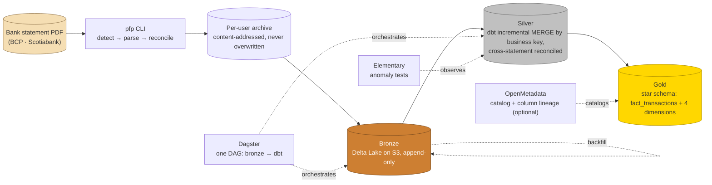

# Personal Finance Data Platform

A local, zero-cost data platform that turns real bank statement PDFs into a governed,
reconciled lakehouse — built to demonstrate Data Engineering / Data Lead practice end to end:
ingestion, schema validation, medallion modeling, CI/CD, and architectural documentation, on
100% open-source tooling.

[](https://github.com/PieroRios2000/personal-finance-platform/actions/workflows/ci.yml)


## What this is

Bank statements (BCP, Scotiabank) come in as password-protected PDFs — some digital, some
scanned. This platform parses them, reconciles every number the PDF itself declares, and
lands them in a bronze → silver → gold medallion lakehouse (a star schema at the end),
orchestrated, quality-checked and catalogued — all runnable locally with `docker compose` and
zero cloud spend. It's the same shape of problem a corporate data platform solves, scaled down
to one person's real financial data, with the same engineering discipline:

| In production, this would be... | Here, it's... |
|---|---|
| Azure Data Factory / ADLS | A Python ingestion CLI + SeaweedFS (S3-compatible) |
| Delta/Parquet in the lake | Delta Lake, written with `delta-rs` |
| Synapse / Databricks | DuckDB, embedded — no JVM, no cluster |
| A modeling layer (dbt on Databricks) | dbt-duckdb, reading Delta straight off S3 |
| An orchestrator (Airflow / ADF pipelines) | Dagster, running the same functions the CLI calls and the dbt project as assets |
| Data quality and a data catalog (Purview, Great Expectations) | Elementary (dbt-native anomaly detection) and OpenMetadata (column-level lineage) |
| A CI/CD quality gate | GitHub Actions: lint, types, tests, security, architecture contracts, impact-based performance benchmarks |

## Architecture



Every PDF is detected by content, never by file name (a file can arrive under any name from
any source); every statement is validated against the balance it declares before a single row
reaches bronze; and a **backfill** command lets a parser fix reach every archived statement,
not just the next one — because a parsing bug doesn't always crash, it can just quietly get a
date or an amount wrong while the balances still add up.

## What's built

### Phase 1 — Foundation

| Layer | Status |
|---|---|
| PDF parsing & reconciliation (BCP) | ✅ Calibrated against real statements — see [below](#built-the-hard-way) |
| PDF parsing & reconciliation (Scotiabank) | ✅ Built — pending real-data validation (dual-currency credit card, opposite sign convention from BCP, handled explicitly) |
| Account kind (asset vs. liability) | ✅ Threaded through parsers → bronze → silver, so cross-bank analysis never assumes one sign convention |
| Currency-aware statement continuity | ✅ A credit-card statement billed in two currencies at once (Soles + Dólares) is still tracked correctly, period by period |
| Inter-account transfer matching | ✅ A checking → credit-card payment (opposite sign conventions) and a same-bank transfer both matched correctly; unmatched candidates surfaced for review, never dropped |
| OCR fallback for scanned pages | ✅ |
| Multi-user, multi-account inbox → archive pipeline | ✅ |
| Bronze (Delta Lake on S3) | ✅ Write, idempotent re-ingest, backfill/replace |
| Silver (dbt) | ✅ Typed model + cross-statement continuity tests |
| CI: lint, types, tests, security, architecture contracts | ✅ Required on every PR |
| CI: impact-based performance benchmarking | ✅ Runs only when a change can affect it |
| CI: ephemeral per-PR environment (real S3, real `dbt build`) | ✅ Spins up, ingests, builds, tears down — nothing left behind |
| CI: base-vs-PR data diff | ✅ Every PR shows what the data itself would change, not just whether tests pass |
| Local exploration: DBeaver + Obsidian | ✅ The same DuckDB file dbt builds opens directly in DBeaver; `brain/` opens as an Obsidian vault, graph view included — see [SETUP.md](SETUP.md) |

### Phase 2 — Orchestration + Governance

| Layer | Status |
|---|---|
| Silver as an incremental MERGE | ✅ A transaction's business key (date, amount, normalized description, account, plus an occurrence number scoped to one source file) drives a dbt `MERGE`; two identical purchases in one statement stay two rows, a regenerated PDF of the same period doesn't duplicate. A backfill updates rows in place |
| Ingestion correctness at the model layer | ✅ A dbt test re-checks every statement period's summed movements against the balance delta the statement itself declares — catches what the MERGE could silently drop or duplicate |
| Gold: star schema | ✅ `fact_transactions` + `dim_date`, `dim_account`, `dim_bank`, `dim_user`. `flow_type` (`ingreso` / `egreso` / `pago`) is direction standardized across banks' opposite sign conventions; currencies are never converted or mixed |
| Orchestration | ✅ Dagster: bronze → every dbt node as one DAG, calling the same functions the CLI does; CI runs the pipeline through it |
| Quality and observability | ✅ Elementary as a dbt package: a row-count anomaly test on silver (warn-mode) and a local HTML report |
| Catalog and column-level lineage | ✅ OpenMetadata (optional, local only, ~4.8 GiB at peak): `fact_transactions.amount` traces back to `bronze.transactions.amount` |
| ML, categories, dashboard | Later phases — see [PROJECT.md](PROJECT.md) |

**Not yet validated against real data:** everything above was verified with synthetic
statements plus the owner's real BCP files. The Scotiabank parser, currency-aware
continuity and transfer matching haven't seen real Scotiabank statements yet —
[`docs/ingesting-your-own-pdfs.md`](docs/ingesting-your-own-pdfs.md) is the walkthrough for
that step (and for running the platform on your own PDFs).

Every decision behind these is written down as an ADR, not just implemented and forgotten —
see [`brain/`](brain/README.md).

## Built the hard way

The BCP parser is the part of this project I'd point to first. It was built against a
synthetic fixture, then run against real statements — and it failed, repeatedly, in ways that
never showed up in a single test case:

1. The real layout didn't use the label text the parser expected at all.
2. A transaction's description started to the *left* of its own column header, corrupting the
   date next to it.
3. A cell printed a literal `0.00` beside the real amount in the next column.
4. Unrelated text leaked into an amount column and crashed the process outright.
5. A 4-page statement silently merged rows from different pages that happened to share a
   y-coordinate — the normal case for any multi-page statement, not an edge case.

Each one was found by running the tool for real, diagnosed from a **masked** layout dump (no
digit or name ever leaves the machine unmasked — see [ADR 0004](brain/decisions/0004-real-pdfs-never-leave-your-machine.md)),
fixed with a regression test reproducing the exact failure, and verified against the real
file before moving on. All four of the owner's real statements now parse and reconcile
end to end. The full story, fix by fix, is in [`brain/components/bcp-parser.md`](brain/components/bcp-parser.md).

## Engineering practices this repo actually follows

- **TDD throughout** — every commit history shows a failing test before its fix.
- **An architecture decision record for every real decision** — [`brain/decisions/`](brain/decisions),
  cross-linked with the components and concepts they justify.
- **Privacy by construction** — no full account number is ever stored (an HMAC identifies an
  account, never the number itself); no real PDF or `.env` is ever read by an AI agent working
  on this repo, only masked layout dumps the owner has reviewed.
- **A quality bar with teeth** — [`CONSTRAINTS.md`](CONSTRAINTS.md) defines the bar and a
  script (`floor_guard.py`) that fails a PR for quietly weakening it (a suppressed lint error,
  a deleted test, a relaxed config), not just for failing it outright.
- **Idempotent by design** — re-ingesting the same file twice adds zero rows; a `--dry-run`
  backfill shows exactly what a parser fix would change before it changes anything.

## Exploring the data

**The data:** `dbt build`'s own output, `dbt/pfp.duckdb`, is a real on-disk DuckDB database —
it opens directly in [DBeaver](https://dbeaver.io/) (or any DuckDB-aware SQL client), silver
with zero setup and bronze's raw Delta tables with a one-time DuckDB persistent-secret step.
Exact commands: **[SETUP.md §7](SETUP.md#7-browsing-the-lake-in-dbeaver)**.

**The architecture itself:** [`brain/`](brain/README.md) is plain Markdown with relative
links between notes, so it opens directly as an [Obsidian](https://obsidian.md/) vault —
every ADR, component and concept connected in a real graph, not just the Mermaid map on
GitHub. Steps: **[SETUP.md §8](SETUP.md#8-browsing-the-brain-in-obsidian)**.

## Quickstart (synthetic data)

Needs the requirements in [SETUP.md](SETUP.md) sections 1–3 (uv, Docker; on Windows, WSL2).
No PDFs needed: a fictional statement is generated for you.

```bash
git clone https://github.com/PieroRios2000/personal-finance-platform.git
cd personal-finance-platform
uv sync --locked

cp .env.example .env && chmod 600 .env
# edit .env: PFP_USER (any name), PFP_ACCOUNT_KEY (openssl rand -hex 32),
# AWS_ACCESS_KEY_ID / AWS_SECRET_ACCESS_KEY (any pair). Leave the rest as it is.

make poc-up                                    # local S3 (SeaweedFS)
set -a && source .env && set +a
export PFP_INBOX_ROOT=/tmp/pfp-demo/inbox PFP_ARCHIVE_ROOT=/tmp/pfp-demo/raw
uv run python -m scripts.seed_synthetic_inbox --inbox-root "$PFP_INBOX_ROOT" --user "$PFP_USER"

uv run dagster asset materialize --select '*'  # bronze -> silver -> gold, one DAG (first run ~2 min)

uv run python -c "import duckdb; duckdb.connect('dbt/pfp.duckdb', read_only=True).sql('select bank, flow_type, currency, count(*) as movements from gold.fact_transactions group by all').show()"
make poc-down                                  # tear the local S3 down (also after a failed step)
```

`PFP_INBOX_ROOT` / `PFP_ARCHIVE_ROOT` only apply to that shell (they point Dagster at a scratch
folder); open a new one before running on real PDFs.

## Getting started

Requirements, versions and the exact steps to run this locally: **[SETUP.md](SETUP.md)**.

Running it on your own real statements, step by step: **[docs/ingesting-your-own-pdfs.md](docs/ingesting-your-own-pdfs.md)**.

The full project vision and phase roadmap (orchestration, gold, ML, a dashboard): **[PROJECT.md](PROJECT.md)**.

The architecture decision log — every *why*, not just the *what*: **[brain/](brain/README.md)**.
