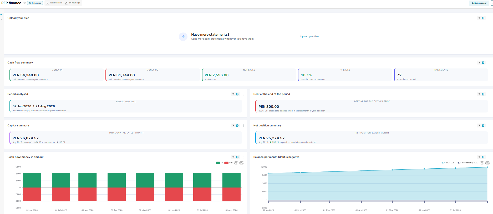
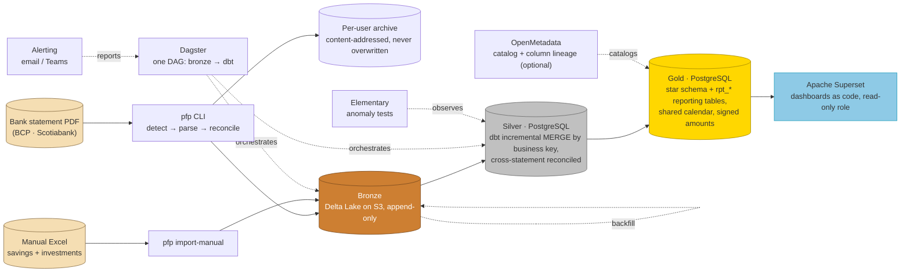

# Personal Finance Data Platform

**A local, zero-cost lakehouse that turns real, password-protected bank statement PDFs into a
reconciled, governed star schema, now growing an ML layer on top (transaction categorization,
human in the loop) — ingestion, dbt, orchestration, CI/CD, ML and architectural decisions, all
built and verified against the owner's own real data.** 90 seconds in: skip to
[**Built the hard way**](#built-the-hard-way) for the part worth reading first.

[](https://github.com/PieroRios2000/personal-finance-platform/actions/workflows/ci.yml)



*Fictional demo data ([`make demo`](#quickstart-artificial-data-to-a-running-dashboard)) — the owner's own real
dashboard looks identical, never shown here (ADR 0004).*

## What this is

Bank statements (BCP, Scotiabank; Banco Ripley is planned) come in as password-protected PDFs — some digital, some
scanned. This platform parses them, reconciles every number the PDF itself declares, and
lands them in a bronze → silver → gold medallion lakehouse (a star schema at the end),
orchestrated, quality-checked and catalogued — all runnable locally with `docker compose` and
zero cloud spend. It's the same shape of problem a corporate data platform solves, scaled down
to one person's real financial data, with the same engineering discipline:

| In production, this would be... | Here, it's... |
|---|---|
| Azure Data Factory / ADLS | A Python ingestion CLI + SeaweedFS (S3-compatible) |
| Delta/Parquet in the lake | Delta Lake, written with `delta-rs` |
| Synapse / Databricks | DuckDB as the engine — no JVM, no cluster — with PostgreSQL as the store for silver and gold (Phase 2 extension) |
| A modeling layer (dbt on Databricks) | dbt-duckdb, reading Delta straight off S3 and writing silver and gold to PostgreSQL |
| An orchestrator (Airflow / ADF pipelines) | Dagster, running the same functions the CLI calls and the dbt project as assets |
| Data quality and a data catalog (Purview, Great Expectations) | Elementary (dbt-native anomaly detection) and OpenMetadata (column-level lineage) |
| A CI/CD quality gate | GitHub Actions: lint, types, tests, security, architecture contracts, impact-based performance benchmarks |

## Architecture


```mermaid
flowchart LR
    PDF[("Bank statement PDF\n(BCP · Scotiabank)")] --> CLI["pfp CLI\ndetect → parse → reconcile"]
    XLS[("Manual Excel\nsavings + investments")] --> IMP["pfp import-manual"]
    CLI --> ARC[("Per-user archive\ncontent-addressed, never overwritten")]
    CLI --> BRZ[("Bronze\nDelta Lake on S3, append-only")]
    IMP --> BRZ
    BRZ --> SLV[("Silver · PostgreSQL\ndbt incremental MERGE by business key,\ncross-statement reconciled")]
    SLV --> GLD[("Gold · PostgreSQL\nstar schema + rpt_* reporting tables,\nshared calendar, signed amounts")]
    GLD --> BI["Apache Superset\ndashboards as code, read-only role"]
    BRZ -.backfill.-> BRZ
    DAG["Dagster\none DAG: bronze → dbt"] -. orchestrates .-> BRZ
    DAG -. orchestrates .-> SLV
    ELEM["Elementary\nanomaly tests"] -. observes .-> SLV
    OM["OpenMetadata\ncatalog + column lineage (optional)"] -. catalogs .-> GLD
    ALERT["Alerting\nemail / Teams"] -. reports .-> DAG

    style PDF fill:#f5deb3,stroke:#8b6f47
    style XLS fill:#f5deb3,stroke:#8b6f47
    style BRZ fill:#cd7f32,stroke:#7a4a1e,color:#fff
    style SLV fill:#c0c0c0,stroke:#6b6b6b
    style GLD fill:#ffd700,stroke:#a68900
    style BI fill:#8ecae6,stroke:#219ebc
```

Every PDF is detected by content, never by file name (a file can arrive under any name from
any source); every statement is validated against the balance it declares before a single row
reaches bronze; and a **backfill** command lets a parser fix reach every archived statement,
not just the next one — because a parsing bug doesn't always crash, it can just quietly get a
date or an amount wrong while the balances still add up.

## What's built

### Phase 1 — Foundation

| Layer | Status |
|---|---|
| PDF parsing & reconciliation (BCP) | ✅ Calibrated against real statements — see [below](#built-the-hard-way) |
| PDF parsing & reconciliation (Scotiabank) | ✅ Calibrated against real statements, in both layouts the bank issues: the dual-currency credit card (opposite sign convention from BCP, handled explicitly) and the savings account (the bank declares totals, so they are checked for real) |
| Account kind (asset vs. liability) | ✅ Threaded through parsers → bronze → silver, so cross-bank analysis never assumes one sign convention |
| Currency-aware statement continuity | ✅ A credit-card statement billed in two currencies at once (Soles + Dólares) is still tracked correctly, period by period |
| Inter-account transfer matching | ✅ A checking → credit-card payment (opposite sign conventions) and a same-bank transfer both matched correctly; unmatched candidates surfaced for review, never dropped |
| OCR fallback for scanned pages | ✅ |
| Multi-user, multi-account inbox → archive pipeline | ✅ |
| Bronze (Delta Lake on S3) | ✅ Write, idempotent re-ingest, backfill/replace |
| Silver (dbt) | ✅ Typed model + cross-statement continuity tests |
| CI: lint, types, tests, security, architecture contracts | ✅ Required on every PR |
| CI: impact-based performance benchmarking | ✅ Runs only when a change can affect it |
| CI: ephemeral per-PR environment (real S3, real `dbt build`) | ✅ Spins up, ingests, builds, tears down — nothing left behind |
| CI: base-vs-PR data diff | ✅ Every PR shows what the data itself would change, not just whether tests pass |
| Local exploration: DBeaver + Obsidian | ✅ The same DuckDB file dbt builds opens directly in DBeaver; `brain/` opens as an Obsidian vault, graph view included — see [SETUP.md](SETUP.md) |

### Phase 2 — Orchestration + Governance

| Layer | Status |
|---|---|
| Silver as an incremental MERGE | ✅ A transaction's business key (date, amount, normalized description, account, plus an occurrence number scoped to one source file) drives a dbt `MERGE`; two identical purchases in one statement stay two rows, a regenerated PDF of the same period doesn't duplicate. A backfill updates rows in place |
| Ingestion correctness at the model layer | ✅ A dbt test re-checks every statement period's summed movements against the balance delta the statement itself declares — catches what the MERGE could silently drop or duplicate |
| Gold: star schema | ✅ `fact_transactions` + `dim_date`, `dim_account`, `dim_bank`, `dim_user`. `flow_type` (`ingreso` / `egreso` / `pago`) is direction standardized across banks' opposite sign conventions; currencies are never converted or mixed |
| Orchestration | ✅ Dagster: bronze → every dbt node as one DAG, calling the same functions the CLI does; CI runs the pipeline through it |
| Quality and observability | ✅ Elementary as a dbt package: a row-count anomaly test on silver (warn-mode) and a local HTML report |
| Catalog and column-level lineage | ✅ OpenMetadata (optional, local only, ~4.8 GiB at peak): `fact_transactions.amount` traces back to `bronze.transactions.amount` |
| Alerting (Phase 7) | ✅ Errors sent the moment they appear, warnings in a weekly digest, by email and/or Microsoft Teams; names and counts only, never real data ([ADR 0026](brain/decisions/0026-alerts-errors-now-warnings-weekly-names-and-counts-only.md)) |
| ML, categories | Phase 3, in progress — see below |

#### Phase 2 extension (closed 2026-09-21): PostgreSQL store and dashboard

Phase 2 was reopened on purpose: the owner wanted an open-source BI tool, the catalog and Dagster to
read what dbt builds *while it builds*, and a DuckDB file has a single writer. So dbt keeps DuckDB as
the engine (it reads bronze from the lake) and stores silver and gold in **PostgreSQL**
([ADR 0029](brain/decisions/0029-dbt-stores-silver-and-gold-in-postgres.md)); **Apache Superset** (open
source, zero cost) reads them. Built in dependency order, T26–T37:

| Task | What |
|---|---|
| T26–T28 | PostgreSQL service and the dbt connection; scripts, Dagster and tests read it; Elementary keeps its own small DuckDB file |
| T29 | CI's ephemeral environment and the PR data diff on PostgreSQL |
| T30 | OpenMetadata reads PostgreSQL with its native connector |
| T31 | Dagster shows where each model is stored and its row count |
| T32 | Superset over a read-only role, dashboards as code |
| T34–T36 | Shared calendar, `signed_amount`, closed months only, capital and net-position cards, per-account reconciliation, period and debt cards |
| T37 | The whole platform as one Compose project: `make up` / `make down` |
| T33 | This re-close: docs, diagram, `make env` + `make demo` (a clean clone reaches a dashboard), a link checker in CI |

Details: [`tasks/todo-phase2.md`](tasks/todo-phase2.md); how the numbers are derived and checked:
[SETUP.md §12](SETUP.md#12-dashboards-in-apache-superset-t32).

### Phase 3 — ML in production *(in progress)*

Automatic transaction categorization, human in the loop: a model proposes a category, the owner
confirms or overrides it — never assigned silently
([ADR 0043](brain/decisions/0043-transaction-categorization-human-in-the-loop-labeling.md)).

| Piece | Status |
|---|---|
| Label collection | ✅ A cold-start, keyword-based guesser proposes a category for every distinct description; the owner edits a local Excel file to confirm or correct it, never typing a category from scratch. Nothing about a real description is ever sent anywhere |
| The category dimension | ✅ `gold.dim_category` (a fixed, short list) and `gold.rpt_movements.category`, left-joined from the owner's confirmed labels, `'Sin categorizar'` until something is labeled |
| A trained classifier | ✅ TF-IDF over character n-grams + logistic regression, trained on the owner's own confirmed labels (not a pretrained model). Reports macro-F1 and precision *per category* — not plain accuracy, which hides a bad category behind a good average when classes are uneven — for the trained model **and** the rules-based guesser side by side, so "does the model beat the rules" has a printed answer every run ([ADR 0044](brain/decisions/0044-category-classifier-char-ngrams-vs-rules-baseline.md)). MLflow-tracked; the model file never leaves the machine, same discipline as a real PDF |
| Serving new movements | ✅ A batch step at ingest: every new description is categorized once, when a statement comes in, and written to bronze; `gold.rpt_movements.category` shows the owner's label, else the prediction, with `category_confirmed` marking which is which ([ADR 0045](brain/decisions/0045-batch-categorization-at-ingest.md)). A FastAPI endpoint is optional, only if a real caller ever needs one |
| Drift monitoring | ✅ `make monitor-category-drift`: an Evidently report comparing the last 90 days of movements against the older ones, on derived features only (bank, currency, flow, description length and digit share, amount, assigned category), never the description text ([ADR 0046](brain/decisions/0046-classifier-drift-monitoring-with-evidently.md)). Honest limit: windows are a few hundred movements, so a flag is a prompt to open the report, not a statistical verdict, and drift is not error |

**Results on the owner's real labels** (589 distinct descriptions he labeled himself, 10 categories in
use; grouped cross-validation by merchant so near-duplicate descriptions never straddle a fold):

| | Macro-F1 | Labels | Folds |
|---|---|---|---|
| Trained model, reviewed labels only | **0.49** | 543 | 3 |
| Trained model, all labels (46 are rule suggestions he accepted as is) | 0.62 | 589 | 5 |
| Keyword-rules baseline, all labels | 0.23 | 589 | n/a (no fitting) |
| Always guessing the biggest category ("Gastos varios", 52% of labels) | 0.07 | 589 | n/a |

Re-run on 2026-10-04 with the same 589 labels (none added since 2026-10-03): the numbers did not
move. Each row above is one label per distinct description. Weighting by movement instead (1,529
movements, so a frequent merchant counts as often as it occurs; merchant-grouped 5-fold, repeated
over 5 shuffles; offline script, not part of the repo) gives 0.593 on all labels and 0.465 on the
reviewed ones (spread 0.04 and 0.01). The two grains answer different questions, so neither replaces the other.

How far to trust these: the label set is small and uneven. The model is solid on the big categories
(precision about 0.9 for the catch-all, 0.8 for travel and entertainment) and weak on small ones
(services, restaurants, food and transport are confused with each other and with the catch-all), so
0.49 is the honest figure, not a headline. The all-labels 0.62 is flattered by the 46 rows where the
rules already had the answer. The rules number is slightly generous (the same 46 rows); scoring the
rules on reviewed labels only (0.05) would be unfair in the other direction, because those are
exactly the rows he corrected. The combined model-plus-rules score used
to pick the confidence threshold is optimistic by construction and is never reported. Adding the bank,
currency, flow, amount or month as extra features did not beat description text alone (differences
within run-to-run noise), so the model stays text-only; more labels in the weak categories is the
lever that matters. Details: [`tasks/backlog.md`](tasks/backlog.md#phase-3--ml-in-production-started-2026-09-27).

### Planned

| Phase | What |
|---|---|
| 6 — Savings-goal projection | Banco Ripley savings and investment tracking through a manual Excel ([template and columns](docs/manual-data.md)), then a projection of how long it takes to reach a savings goal at the owner's real cash flow. Goals can be in soles or dollars, with a sol/dólar exchange-rate projection that exists only in this phase (the lake itself never converts currencies). Only liquid money in bank accounts counts; investments elsewhere (mutual funds) are deliberately left out of the goal, and tracked separately for their monthly return ([ADR 0028](brain/decisions/0028-investment-return-is-modified-dietz-per-fund-and-month.md)) — [ADR 0025](brain/decisions/0025-savings-goal-projection-counts-liquid-savings-only.md) |


The order of what is next is in [`tasks/backlog.md`](tasks/backlog.md).

**Validated against real data (2026-09):** all of the owner's real statements (60 BCP, 25
Scotiabank) parse and reconcile, and running them through the lake exposed the problems
synthetic data could not: a bank re-download with identical content, statement cycles that do
not tile the calendar, and Scotiabank's second layout. Each one became a fix with a regression
test. [`docs/ingesting-your-own-pdfs.md`](docs/ingesting-your-own-pdfs.md) is the walkthrough
for running the platform on your own PDFs.

Every decision behind these is written down as an ADR, not just implemented and forgotten —
see [`brain/`](brain/README.md).

## Built the hard way

The BCP parser is the part of this project I'd point to first. It was built against a
synthetic fixture, then run against real statements — and it failed, repeatedly, in ways that
never showed up in a single test case:

1. The real layout didn't use the label text the parser expected at all.
2. A transaction's description started to the *left* of its own column header, corrupting the
   date next to it.
3. A cell printed a literal `0.00` beside the real amount in the next column.
4. Unrelated text leaked into an amount column and crashed the process outright.
5. A 4-page statement silently merged rows from different pages that happened to share a
   y-coordinate — the normal case for any multi-page statement, not an edge case.

Each one was found by running the tool for real, diagnosed from a **masked** layout dump (no
digit or name ever leaves the machine unmasked — see [ADR 0004](brain/decisions/0004-real-pdfs-never-leave-your-machine.md)),
fixed with a regression test reproducing the exact failure, and verified against the real
file before moving on. All of the owner's real BCP statements now parse and reconcile
end to end. The full story, fix by fix, is in [`brain/components/bcp-parser.md`](brain/components/bcp-parser.md).

## Engineering practices this repo actually follows

- **TDD throughout** — every commit history shows a failing test before its fix.
- **An architecture decision record for every real decision** — [`brain/decisions/`](brain/decisions),
  cross-linked with the components and concepts they justify.
- **Privacy by construction** — no full account number is ever stored (an HMAC identifies an
  account, never the number itself); no real PDF or `.env` is ever read by an AI agent working
  on this repo, only masked layout dumps the owner has reviewed.
- **A quality bar with teeth** — [`CONSTRAINTS.md`](CONSTRAINTS.md) defines the bar and a
  script (`floor_guard.py`) that fails a PR for quietly weakening it (a suppressed lint error,
  a deleted test, a relaxed config), not just for failing it outright.
- **Idempotent by design** — re-ingesting the same file twice adds zero rows; a `--dry-run`
  backfill shows exactly what a parser fix would change before it changes anything.

## Exploring the data

**The data:** open Superset for the dashboards (`make up`, then the URL `make status` prints), or
connect any SQL client — [DBeaver](https://dbeaver.io/) works — to the local PostgreSQL that dbt builds
into: schemas `silver` and `gold`, with a read-only role (`pfp_bi`) that sees `gold` only. Exact
commands: **[SETUP.md §7](SETUP.md#7-browsing-the-lake-in-dbeaver)**.

**The architecture itself:** [`brain/`](brain/README.md) is plain Markdown with relative
links between notes, so it opens directly as an [Obsidian](https://obsidian.md/) vault —
every ADR, component and concept connected in a real graph, not just the Mermaid map on
GitHub. Steps: **[SETUP.md §8](SETUP.md#8-browsing-the-brain-in-obsidian)**.

## Quickstart (artificial data, to a running dashboard)

Needs the requirements in [SETUP.md](SETUP.md) sections 1–3 (uv, Docker; on Windows, WSL2).
No PDFs needed: a fictional person's eight closed months are generated for you.

```bash
git clone https://github.com/PieroRios2000/personal-finance-platform.git
cd personal-finance-platform
uv sync --locked

make env        # writes .env with generated secrets (never overwrites yours)
make up         # local S3, PostgreSQL and Superset, one Compose project (first run builds an image, ~2 min)
make demo       # artificial data -> bronze, then dbt build: silver, gold, the dashboard's tables
make status     # prints the URLs
```

Open the Superset URL from `make status` (user `admin`, password `PFP_BI_ADMIN_PASSWORD` in `.env`),
then *Dashboards → PFP finance*. When done: `make down` stops everything and keeps the data;
`make poc-down` stops it and **deletes** it.

Several environments on one machine (dev with your real data, prod with the artificial data, each with its own
stack): [SETUP.md §14](SETUP.md#14-dev-and-prod-environments-t38).

The same pipeline through Dagster (`uv run dagster asset materialize --select '*'`) and on a synthetic
PDF are in [SETUP.md](SETUP.md) sections 6 and 9; running on your own PDFs is
[docs/ingesting-your-own-pdfs.md](docs/ingesting-your-own-pdfs.md).

## Getting started

Requirements, versions and the exact steps to run this locally: **[SETUP.md](SETUP.md)**.

Running it on your own real statements, step by step: **[docs/ingesting-your-own-pdfs.md](docs/ingesting-your-own-pdfs.md)**.
Where to open each stage in a browser (S3, Dagster, DuckDB, dbt docs, Superset, MLflow): **[docs/where-to-look.md](docs/where-to-look.md)**.
Rebuilding everything from your archive: [docs/runbook-rebuild-from-archive.md](docs/runbook-rebuild-from-archive.md). What went wrong and what changed: [docs/incidents/](docs/incidents/README.md); what was run: [docs/operations-log.md](docs/operations-log.md).

The full project vision and phase roadmap (orchestration, gold, ML, a dashboard): **[PROJECT.md](PROJECT.md)**.

The architecture decision log — every *why*, not just the *what*: **[brain/](brain/README.md)**.
