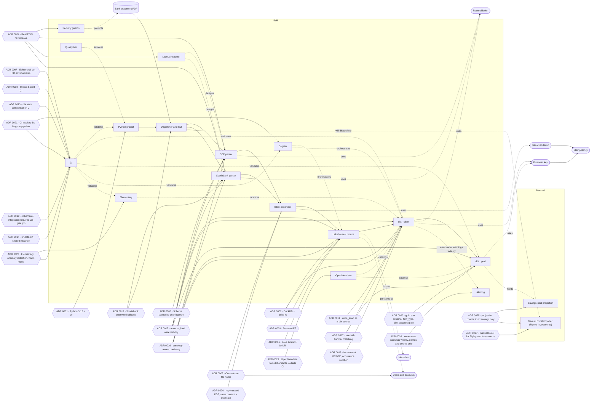

# Project brain

Linked notes that explain **why** the project is the way it is: the concepts it uses, the
pieces that make it up, the decisions behind it, and what phase each thing is in. The code
says *what* it does; this is the context.

- **On GitHub:** navigate through each note's links.
- **In Obsidian:** open the `brain/` folder as a vault; the graph view draws the relationships.

## Map



Rectangle = component · oval = concept · hexagon = decision (ADR) · dotted line = uses relationship.

## Index

| Type | Notes |
|---|---|
| Phases | [Phase 1 — Foundation](phases/phase-1.md) · [Phase 2 — Orchestration + Governance](phases/phase-2.md) · [Phase 6 — Savings-goal projection (planned)](phases/phase-6.md) · [Phase 7 — Alerting](phases/phase-7.md) |
| Components | [Security guards](components/security-guards.md) · [Python project](components/python-project.md) · [CI](components/ci.md) · [Layout inspector](components/layout-inspector.md) · [Quality bar](components/quality-bar.md) · [BCP parser](components/bcp-parser.md) · [Scotiabank parser](components/scotiabank-parser.md) · [Dispatcher and CLI](components/cli.md) · [Inbox organizer](components/inbox-organizer.md) · [Lakehouse](components/lakehouse.md) · [dbt silver](components/dbt-silver.md) · [dbt gold](components/dbt-gold.md) · [dagster](components/dagster.md) · [Elementary](components/elementary.md) · [OpenMetadata](components/openmetadata.md) · [Alerting](components/alerting.md) |
| Concepts | [Medallion](concepts/medallion.md) · [Idempotency](concepts/idempotency.md) · [Business key](concepts/business-key.md) · [Reconciliation](concepts/reconciliation.md) · [File-level dedup](concepts/file-level-dedup.md) · [Users and accounts](concepts/users-and-accounts.md) · [Savings-goal projection](concepts/savings-goal-projection.md) |
| Decisions | [0001 Python 3.12 with uv](decisions/0001-python-312-with-uv.md) · [0002 DuckDB + delta-rs](decisions/0002-duckdb-and-delta-rs-before-spark.md) · [0003 SeaweedFS](decisions/0003-local-s3-with-seaweedfs.md) · [0004 Real PDFs](decisions/0004-real-pdfs-never-leave-your-machine.md) · [0005 Schema scoped to user/account](decisions/0005-transaction-schema-with-user-and-account.md) · [0006 Lake location by URI](decisions/0006-lake-location-by-uri.md) · [0007 Ephemeral per-PR environments](decisions/0007-ephemeral-per-pr-environments.md) · [0008 Impact-based CI](decisions/0008-impact-based-ci.md) · [0009 Content over file name](decisions/0009-multi-user-multi-account-content-over-filename.md) · [0010 Backfill replaces a file's rows](decisions/0010-bronze-backfill-replaces-not-versions.md) · [0011 delta_scan as a dbt source](decisions/0011-delta-scan-as-a-dbt-source.md) · [0012 Scotiabank password fallback](decisions/0012-scotiabank-password-fallback-detection.md) · [0013 dbt state comparison in CI](decisions/0013-dbt-state-comparison-via-a-base-ref-worktree.md) · [0014 pr-data-diff shared instance](decisions/0014-pr-data-diff-shared-instance-full-build.md) · [0015 account_kind asset/liability](decisions/0015-account-kind-asset-or-liability.md) · [0016 Currency-aware statement continuity](decisions/0016-currency-aware-statement-continuity.md) · [0017 Internal-transfer matching](decisions/0017-internal-transfer-matching-mutual-nearest-neighbor.md) · [0018 Incremental MERGE, occurrence-number business key](decisions/0018-incremental-merge-business-key-occurrence-number.md) · [0019 ephemeral-integration required via gate job](decisions/0019-ephemeral-integration-required-via-gate-job.md) · [0020 Gold star schema, flow_type, dim_account grain](decisions/0020-gold-star-schema-flow-type-and-dim-account-grain.md) · [0021 CI invokes the Dagster pipeline](decisions/0021-ci-invokes-the-dagster-pipeline.md) · [0022 Elementary anomaly detection, warn-mode](decisions/0022-elementary-anomaly-detection-and-warn-mode.md) · [0023 OpenMetadata from dbt artifacts, outside CI](decisions/0023-openmetadata-catalog-and-column-lineage-from-dbt-artifacts.md) · [0024 Regenerated PDF with identical content is a duplicate](decisions/0024-regenerated-pdfs-with-identical-content-are-duplicates.md) · [0025 Projection counts liquid savings only](decisions/0025-savings-goal-projection-counts-liquid-savings-only.md) · [0026 Alerts: errors now, warnings weekly](decisions/0026-alerts-errors-now-warnings-weekly-names-and-counts-only.md) · [0027 Manual Excel for Ripley and investments](decisions/0027-manual-excel-for-ripley-savings-and-investment-tracking.md) |

## Note conventions

- **One idea per note**, in the folder for its type: `concepts/`, `components/`, `decisions/`, `phases/`.
- **File name** in lowercase, hyphen-separated (`business-key.md`); ADRs start with their
  number (`0001-…`).
- **Frontmatter** at the top of every note:

  ```yaml
  ---
  type: concept   # concept | component | decision | phase
  phase: 1        # phase it appears in
  ---
  ```

  Decisions add `status` (proposed | accepted | superseded) and `date`; components add
  `status` (planned | in-progress | built) and `task`.
- **Relationships as relative links** in each note's "Related" section: GitHub navigates them
  and Obsidian draws them in the graph. They're not repeated in the frontmatter, so there's
  only one list to keep up to date.
- **Templates** in `brain/_templates/`: copy the one for the type you need.
- **Every PR updates the brain**: the component or concept note it touches, and the
  [phase note](phases/phase-1.md). A new decision is a new ADR; ADRs are never deleted, only
  superseded by another one that references them.
