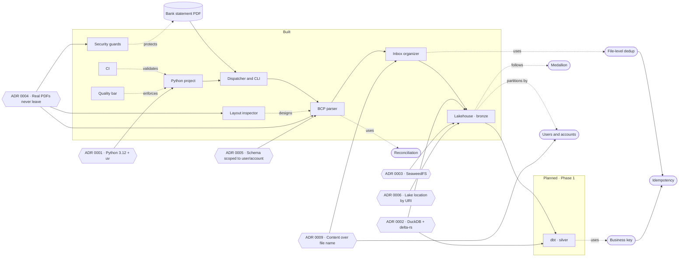

# Project brain

Linked notes that explain **why** the project is the way it is: the concepts it uses, the
pieces that make it up, the decisions behind it, and what phase each thing is in. The code
says *what* it does; this is the context.

- **On GitHub:** navigate through each note's links.
- **In Obsidian:** open the `brain/` folder as a vault; the graph view draws the relationships.

## Map



Rectangle = component · oval = concept · hexagon = decision (ADR) · dotted line = uses relationship.

## Index

| Type | Notes |
|---|---|
| Phases | [Phase 1 — Foundation](phases/phase-1.md) |
| Components | [Security guards](components/security-guards.md) · [Python project](components/python-project.md) · [CI](components/ci.md) · [Layout inspector](components/layout-inspector.md) · [Quality bar](components/quality-bar.md) · [BCP parser](components/bcp-parser.md) · [Dispatcher and CLI](components/cli.md) · [Inbox organizer](components/inbox-organizer.md) · [Lakehouse](components/lakehouse.md) |
| Concepts | [Medallion](concepts/medallion.md) · [Idempotency](concepts/idempotency.md) · [Business key](concepts/business-key.md) · [Reconciliation](concepts/reconciliation.md) · [File-level dedup](concepts/file-level-dedup.md) · [Users and accounts](concepts/users-and-accounts.md) |
| Decisions | [0001 Python 3.12 with uv](decisions/0001-python-312-with-uv.md) · [0002 DuckDB + delta-rs](decisions/0002-duckdb-and-delta-rs-before-spark.md) · [0003 SeaweedFS](decisions/0003-local-s3-with-seaweedfs.md) · [0004 Real PDFs](decisions/0004-real-pdfs-never-leave-your-machine.md) · [0005 Schema scoped to user/account](decisions/0005-transaction-schema-with-user-and-account.md) · [0006 Lake location by URI](decisions/0006-lake-location-by-uri.md) · [0007 Ephemeral per-PR environments](decisions/0007-ephemeral-per-pr-environments.md) · [0009 Content over file name](decisions/0009-multi-user-multi-account-content-over-filename.md) |

## Note conventions

- **One idea per note**, in the folder for its type: `concepts/`, `components/`, `decisions/`, `phases/`.
- **File name** in lowercase, hyphen-separated (`business-key.md`); ADRs start with their
  number (`0001-…`).
- **Frontmatter** at the top of every note:

  ```yaml
  ---
  type: concept   # concept | component | decision | phase
  phase: 1        # phase it appears in
  ---
  ```

  Decisions add `status` (proposed | accepted | superseded) and `date`; components add
  `status` (planned | in-progress | built) and `task`.
- **Relationships as relative links** in each note's "Related" section: GitHub navigates them
  and Obsidian draws them in the graph. They're not repeated in the frontmatter, so there's
  only one list to keep up to date.
- **Templates** in `brain/_templates/`: copy the one for the type you need.
- **Every PR updates the brain**: the component or concept note it touches, and the
  [phase note](phases/phase-1.md). A new decision is a new ADR; ADRs are never deleted, only
  superseded by another one that references them.
