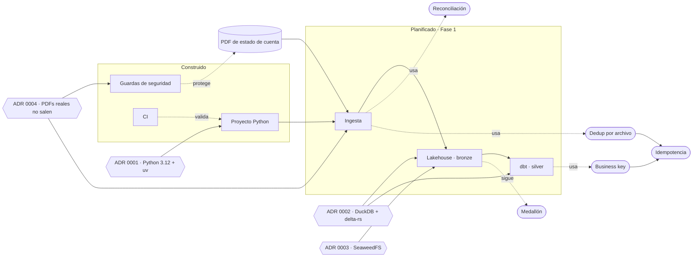

# Cerebro del proyecto

Notas enlazadas que explican **por qué** el proyecto es como es: los conceptos que usa, las piezas
que lo forman, las decisiones que se tomaron y en qué fase está cada cosa. El código dice *qué* hace;
aquí está el contexto.

- **En GitHub:** navega con los links de cada nota.
- **En Obsidian:** abre la carpeta `brain/` como vault; la vista de grafo dibuja las relaciones.

## Mapa



Rectángulo = componente · óvalo = concepto · hexágono = decisión (ADR) · línea punteada = relación de uso.

## Índice

| Tipo | Notas |
|---|---|
| Fases | [Fase 1 — Fundación](fases/fase-1.md) |
| Componentes | [Guardas de seguridad](componentes/guardas-de-seguridad.md) · [Proyecto Python](componentes/proyecto-python.md) · [CI](componentes/ci.md) |
| Conceptos | [Medallón](conceptos/medallon.md) · [Idempotencia](conceptos/idempotencia.md) · [Business key](conceptos/business-key.md) · [Reconciliación](conceptos/reconciliacion.md) · [Dedup por archivo](conceptos/dedup-por-archivo.md) |
| Decisiones | [0001 Python 3.12 con uv](decisiones/0001-python-312-con-uv.md) · [0002 DuckDB + delta-rs](decisiones/0002-duckdb-y-delta-rs-antes-que-spark.md) · [0003 SeaweedFS](decisiones/0003-s3-local-con-seaweedfs.md) · [0004 PDFs reales](decisiones/0004-pdfs-reales-no-salen-de-la-maquina.md) |

## Convención de notas

- **Una idea por nota**, en la carpeta de su tipo: `conceptos/`, `componentes/`, `decisiones/`, `fases/`.
- **Nombre del archivo** en minúsculas, con guiones y sin tildes (`business-key.md`); los ADR empiezan
  con su número (`0001-…`).
- **Frontmatter** al inicio de cada nota:

  ```yaml
  ---
  tipo: concepto   # concepto | componente | decision | fase
  fase: 1          # fase en la que aparece
  ---
  ```

  Las decisiones añaden `estado` (propuesta | aceptada | reemplazada) y `fecha`; los componentes,
  `estado` (planificado | en-curso | construido) y `tarea`.
- **Relaciones como links relativos** en la sección "Relacionado" de cada nota: GitHub los navega y
  Obsidian los dibuja en el grafo. No se repiten en el frontmatter, para no mantener dos listas.
- **Plantillas** en `brain/_plantillas/`: copia la del tipo que necesites.
- **Cada PR actualiza el cerebro**: la nota del componente o concepto que toca y la
  [nota de la fase](fases/fase-1.md). Una decisión nueva es un ADR nuevo; los ADR no se borran, se
  reemplazan con otro que los referencia.
